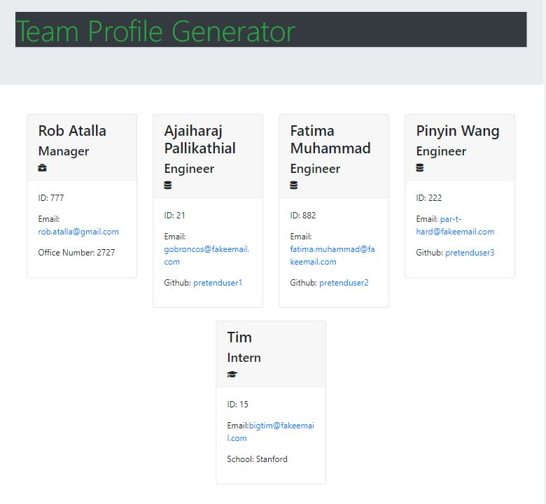

# Team Profile Generator

  
    
  
   
  
   
  
   
  
   
  
  
  ## Description
  
  The user can Generate team member profiles using terminal prompts that can be viewed in their browser. 
 
  ## Table of Contents
  - [Description](#description)
  - [Documentation](#documentation)
  - [Usage](#usage)
  - [Screenshot](#screenshot)
  - [Features](#features)
  - [Acknowledgements](#acknowledgements)
  - [License](#license)
  - [Testing](#testing)
  - [Contact](#contact)

  ## Documentation
  Ensure you have Node js installed on your computer. Then navigate to the root folder and type the command: node index.js in your terminal. 
  A set of guided prompts will appear in the terminal asking questions about the employees on your team. Once all the questions have answered, a file titled "index.html"
  will be generated inside the dist folder. Click on the file and open it in your browser to view your team members' profiles. 
 
  ## Usage
  The application allows managers and employees to view their collegues' name, role, contact details, and more in a single source. 

  ## Screenshot
  

  ## Features
  Collects profile details for multiple employees through the terminal using Node.js and npm Inquirer and displays the data in an index.html that can be 
  easily viewed in the browser. The data can also be tested using Jest. 
  
  # Acknowledgements
  Rob Atalla, Nathan Szurek (Tutor), Calvin Freese (TA), Kelsey Gasser (TA) Brian Wilde (Classmate)
    
  ## License
  
   
  Permission to use this application is granted under the MIT license. <https://opensource.org/licenses/MIT>

  ## Testing
  There are five test.js files included in the _tests_ folder that contain functions that allow application data to be verified using Jest. 
  Navigate to the root folder and enter: npm i -D jest in the terminal to install the Jest test suite. The enter: npm test in the terminal and jest will begin running a series of automated tests against the functions and data contained in the _tests_ files. The test will conclude by generating a report that identifies which tests passed or failed. Please note that failures can be caused by incorrect application data OR by ill-concieved testing functions or conventions. (There might be a bit of both in this application..)

  ## Contact:
  Holler at me! <a href="mailto:rob.atalla@gmail.com">rob.atalla@gmail.com</a>